# Quebra-cabe-a-deslizante

um problema lógico complicado de se resolver, mas é dividir para conquistar
e é isso o que eu estou fazendo, dividindo em funções e testando até ficar correto

# ALGORÍTMO PARA RESOLVER
- geração de uma matriz 2d 3x3 
- geração de um zero obrigatório na matriz
- função encontrar o menor da vez que serve para quando for ordenar a matriz essa função vai buscar pelo menor índice
- EXEMPLO

- array aleatório inicial  
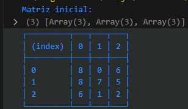  

- movimentações  
 
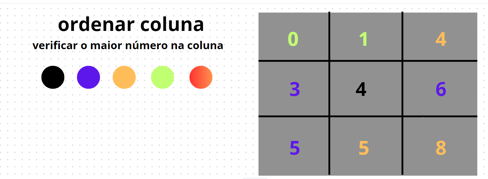 
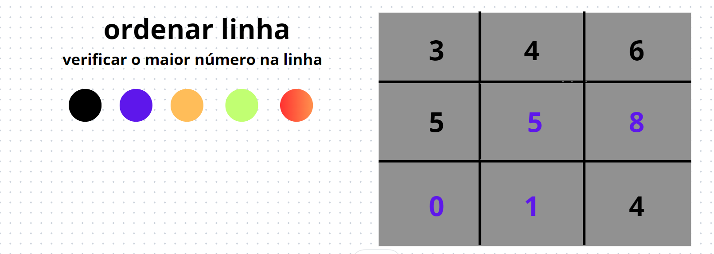 
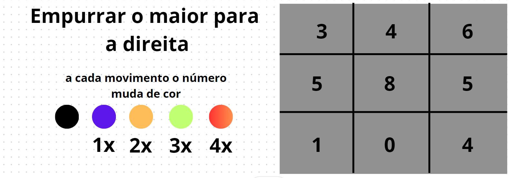 
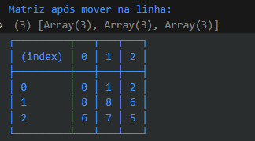 
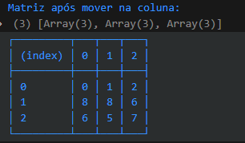 
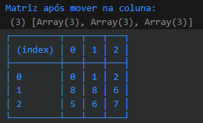 
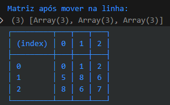 
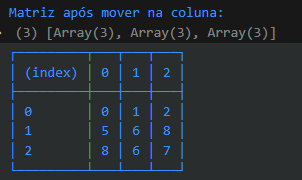 
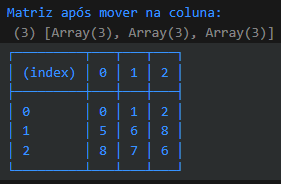 
 
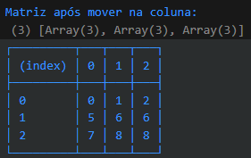 
# minhas anotações

- acho que vou ter alguns problemas como dois laços for dentro de dois laços for 
- uma função para encontrar o menor indice 
- e essa função deve ficar dentor dos laços que percorrer o array

- fiz alguns testes usando o canva e desenhando a matriz e movendo manualmente o índice de lugar
- eu estava movendo para direita e para baixo verificando se era maior que esses números e quando dava true, ou seja era maior a busca se reiniciava
- mas aconteceu um certo erro que existe uma chance de um número muito distante não conseguir verificar e impedindo a ordenação

- aqui o 4 está antes do 3 mas seguindo esse algorítimo descrito existe uma pequena chance de não ordenar

- foi ae que eu tive uma outra idéia 
- ordenaar primeiro linha depois coluna, toda vez que trocar começar de novo na linha ou na coluna
- sempre procurando o maior

- novamente o algorítimo não resolveu o problema
- o erro desse algorítimo foi pior que o anterior 

- percebi que esse erro é justamente porque é limitado a questão da troca

- percebi que não é possível deslizar de longe mas é possível verificar percorrendo o array

# definindo o primeiro índice
- vericar apartir do primeiro número e percorrer pra ver se ele é o menor
- se sim continua verificando o array até chegar no último elemento
- se encontrar um elemento menor a variável menor que armazena a posição é trocada para o próximo menor
- chegou até o fim move para a última linha e última coluna
- vai até o indice 0 da coluna e depois na linha
- depois de achar o menor índice devemos achar o segundo menor índice

# definindo o segundo índice
- o array já foi percorrido e agora devemos ir para o segundo índice
- nesse caso esse índice deve estar na mesma coluna do segundo menor
- desliza o segundo menor até a coluna 1
- depois desliza até o lugar do segundo menor `array[linha0][coluna1]`

# definindo o terceiro índice
- passa para o próximo intem e faz a busca para descobrir o menor número depois de
`array[linha0][coluna2]`
- tenho que levar o menor até a coluna do que seria o terceiro menor
- depois ir deslizando na coluna até fazer a troca do índice

# resumo do algorítimo 
- gerar matriz aleatório
- gerar um zero aleatório na matriz
- ordenar a matriz
- VOCÊ NÃO PODE SIMPLISMENTE TROCAR UM ÍNDICE PELO O OUTRO SEM ELE ESTAR COM UM DE DIFERENÇA
- começa apartir do `PRIMEIRO ÍNDICE`
- use uma variável menor para percorrer o array tentando descobrir qual é o menor
- se o `ÌNDICE ATUAL` for o menor passa para o próximo
- se não ache o menor percorrendo o array até o final
- depois de achar o menor 
- mova o menor até a mesma coluna do índice que você está usando como base
- de ínicio é o `array[linha0][coluna0]`
- depois deslize ele na coluna fazendo swap(trocas) até finalmente ele ser o menor
- TODA VEZ QUE FIZER UMA TROCA IMPRIMA O ARRAY APÓS A TROCA
- passe para o próximo item da linha
- se não ouver outro intem na linha passe para a próxima coluna
- se não ouver a próxima coluna o problema foi resolvido

