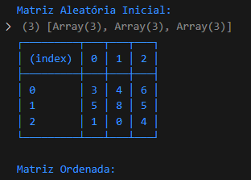
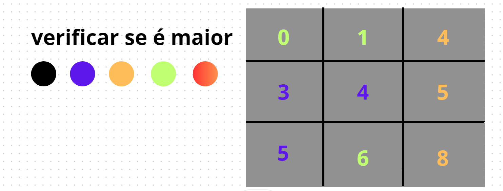

# Quebra-cabe-a-deslizante

um problema lógico complicado de se resolver, mas é dividir para conquistar
e é isso o que eu estou fazendo, dividindo em funções e testando até ficar correto

# fotos

- falta ordenar a matriz  

# minhas anotações
- fiz alguns testes usando o canva e desenhando a matriz e movendo manualmente o índice de lugar
- eu estava movendo para direita e para baixo verificando se era maior que esses números e quando dava true, ou seja era maior a busca se reiniciava
- mas aconteceu um certo erro que existe uma chance de um número muito distante não conseguir verificar e impedindo a ordenação
- como nesse exemplo
 

 
- aqui o 4 está antes do 3 mas seguindo esse algorítimo descrito existe uma pequena chance de não ordenar
