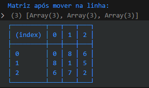
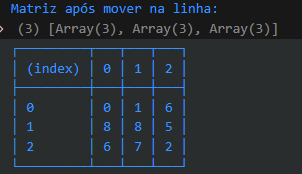
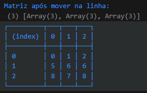

# Quebra-cabe-a-deslizante

um problema lógico complicado de se resolver, mas é dividir para conquistar
e é isso o que eu estou fazendo, dividindo em funções e testando até ficar correto

# ALGORÍTMO PARA RESOLVER
- geração de uma matriz 2d 3x3 
- geração de um zero obrigatório na matriz
- função encontrar o menor da vez que serve para quando for ordenar a matriz essa função vai buscar pelo menor índice
- EXEMPLO

- array aleatório inicial  
  

- movimentações  
 
 
 
 
 
 
 
 
 
 
 
 

# Como Funciona a Função ordenarMatriz
Este documento fornece uma explicação passo a passo de como a função ordenarMatriz funciona para ordenar uma matriz 2D. Esse guia pode ser usado para implementar o mesmo algoritmo em qualquer linguagem de programação.

# Objetivo
A função ordenarMatriz reorganiza os elementos de uma matriz bidimensional (2D) de modo que eles fiquem em ordem crescente, movendo cada elemento um passo por vez até que ele esteja na posição correta. A matriz é ordenada da esquerda para a direita, e de cima para baixo.

# Estrutura da Função
1. Inicialização
- A função recebe uma matriz 2D como entrada criada aleatóriamente
- As variáveis linhas e colunas são definidas para armazenar o número de linhas e colunas da matriz, respectivamente.
2. Percorrendo a Matriz
- A função usa dois laços for para iterar sobre cada posição da matriz. O primeiro laço (i) percorre as linhas e o segundo laço (j) percorre as colunas.
- Cada posição (i, j) da matriz é tratada como o "índice de referência" atual, que é o ponto a partir do qual procuraremos o menor valor ainda não ordenado.
3. Encontrar o Menor Valor
- A função busca o menor valor na matriz que ainda não foi ordenado, começando a busca na posição (i, j).
- Esse menor valor pode estar em qualquer lugar após a posição (i, j), e a função encontra sua posição, armazenada em posMenor.
4. Mover o Menor Valor para a Coluna Correta
- Uma vez identificado o menor valor, a função o move para a coluna da posição de referência (i, j) um passo por vez.
- Se o menor valor estiver à direita da coluna de referência, ele é movido para a esquerda, e vice-versa.
- Após cada movimento, a matriz é impressa para mostrar o estado atual.
5. Mover o Menor Valor para a Linha Correta
- Após posicionar o menor valor na coluna correta, a função o move dentro da coluna até que ele esteja na linha correta.
- Se o menor valor estiver abaixo da linha de referência, ele é movido para cima, e vice-versa.
- A matriz é novamente impressa após cada movimento.
6. Repetir para Todos os Elementos
- O processo acima é repetido para cada elemento da matriz, até que todos os elementos estejam ordenados.

# minhas anotações

- acho que vou ter alguns problemas como dois laços for dentro de dois laços for 
- uma função para encontrar o menor indice 
- e essa função deve ficar dentor dos laços que percorrer o array

- fiz alguns testes usando o canva e desenhando a matriz e movendo manualmente o índice de lugar
- eu estava movendo para direita e para baixo verificando se era maior que esses números e quando dava true, ou seja era maior a busca se reiniciava
- mas aconteceu um certo erro que existe uma chance de um número muito distante não conseguir verificar e impedindo a ordenação

- aqui o 4 está antes do 3 mas seguindo esse algorítimo descrito existe uma pequena chance de não ordenar

- foi ae que eu tive uma outra idéia 
- ordenaar primeiro linha depois coluna, toda vez que trocar começar de novo na linha ou na coluna
- sempre procurando o maior

- novamente o algorítimo não resolveu o problema
- o erro desse algorítimo foi pior que o anterior 

- percebi que esse erro é justamente porque é limitado a questão da troca

- percebi que não é possível deslizar de longe mas é possível verificar percorrendo o array