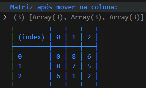
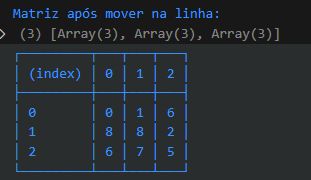

# Quebra-cabe-a-deslizante

um problema lógico complicado de se resolver, mas é dividir para conquistar
e é isso o que eu estou fazendo, dividindo em funções e testando até ficar correto

# fotos

- falta ordenar a matriz  

# minhas anotações

- acho que vou ter alguns problemas como dois laços for dentro de dois laços for 
- uma função para encontrar o menor indice 
- e essa função deve ficar dentor dos laços que percorrer o array

- fiz alguns testes usando o canva e desenhando a matriz e movendo manualmente o índice de lugar
- eu estava movendo para direita e para baixo verificando se era maior que esses números e quando dava true, ou seja era maior a busca se reiniciava
- mas aconteceu um certo erro que existe uma chance de um número muito distante não conseguir verificar e impedindo a ordenação
- como nesse exemplo

- aqui o 4 está antes do 3 mas seguindo esse algorítimo descrito existe uma pequena chance de não ordenar

- foi ae que eu tive uma outra idéia 
- ordenaar primeiro linha depois coluna, toda vez que trocar começar de novo na linha ou na coluna
- sempre procurando o maior

- novamente o algorítimo não resolveu o problema
- o erro desse algorítimo foi pior que o anterior 
- nas fotos seguintes tem o último movimento na linha e na coluna

- percebi que esse erro é justamente porque é limitado a questão da troca

- percebi que não é possível deslizar de longe mas é possível verificar percorrendo o array
- início

# definindo o primeiro índice
- vericar apartir do primeiro número e percorrer pra ver se ele é o menor
- se sim continua verificando o array até chegar no último elemento
- se encontrar um elemento menor a variável menor que armazena a posição é trocada para o próximo menor
- chegou até o fim move para a última linha e última coluna
- vai até o indice 0 da coluna e depois na linha
- depois de achar o menor índice devemos achar o segundo menor índice

# definindo o segundo índice
- o array já foi percorrido e agora devemos ir para o segundo índice
- nesse caso esse índice deve estar na mesma coluna do segundo menor
- desliza o segundo menor até a coluna 1
- depois desliza até o lugar do segundo menor `array[linha0][coluna1]`

# definindo o terceiro índice
- passa para o próximo intem e faz a busca para descobrir o menor número depois de
`array[linha0][coluna2]`
- tenho que levar o menor até a coluna do que seria o terceiro menor
- depois ir deslizando na coluna até fazer a troca do índice

# resumo do algorítimo 
- começa apartir do `array[linha0][coluna0]`
- use uma variável menor para percorrer o array tentando descobrir qual é o menor
- se o `array[linha0][coluna0]` for o menor passa para o próximo
- se não ache o menor percorrendo o array até o final
- depois de achar o menor 
- mova o menor até a mesma coluna do índice que você está usando como base
- de ínicio é o `array[linha0][coluna0]`
- depois deslize ele na coluna fazendo swap(trocas) até finalmente ele ser o menor
- passe para o próximo item da linha
- se não ouver outro intem na linha passe para a próxima coluna
- se não ouver a próxima coluna o problema foi resolvido

# código para reutilizar 
if (menor >= matriz[linha + 1][coluna] && indiceExiste(matriz, linha + 1, coluna)) {
                console.log(contador)
                contador++
            }

matriz = trocarElementos(
                        matriz, posicaoDoAtual.linha , posicaoDoAtual.coluna
                        , posicaoDoMenor.linha , posicaoDoMenor.coluna
                    )

if (estaNaMesmaColuna(posicaoDoAtual.coluna,posicaoDoMenor.coluna)) {
                    
                    if (diferençaDeUm(posicaoDoAtual.coluna,posicaoDoMenor.coluna)) {
                        // mover para o índice correto
                        //trocarElementos(matriz,)
                      
                    }
                    else {
                        // precisa fazer dois movimentos para chegar no local correto

                    }
                }
                else {
                    // não está na mesma coluna e deve mover pra mesma coluna
                }
                // vai ter uma função para mover até o menor
                // precisa verificar se o menor está na mesma coluna
                // depois de mover até o menor recomeçar
